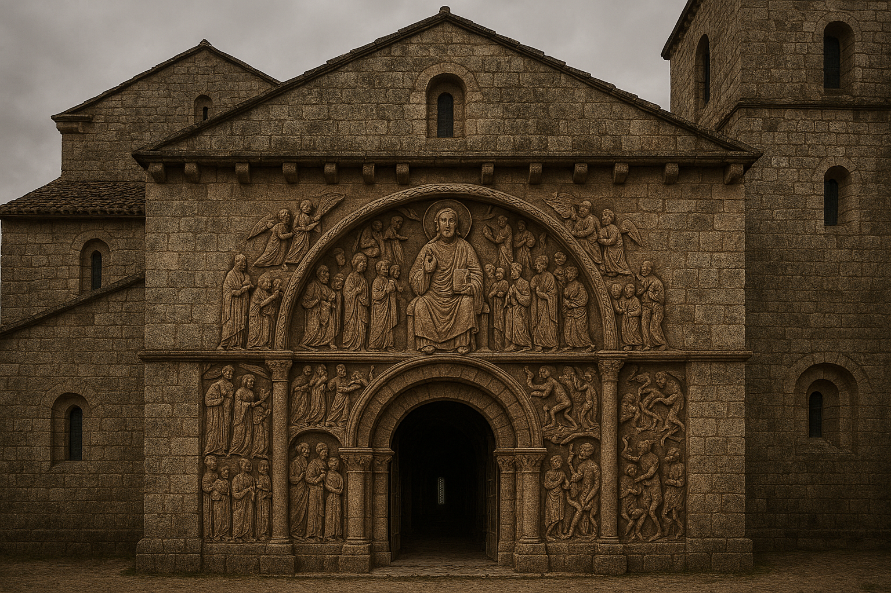
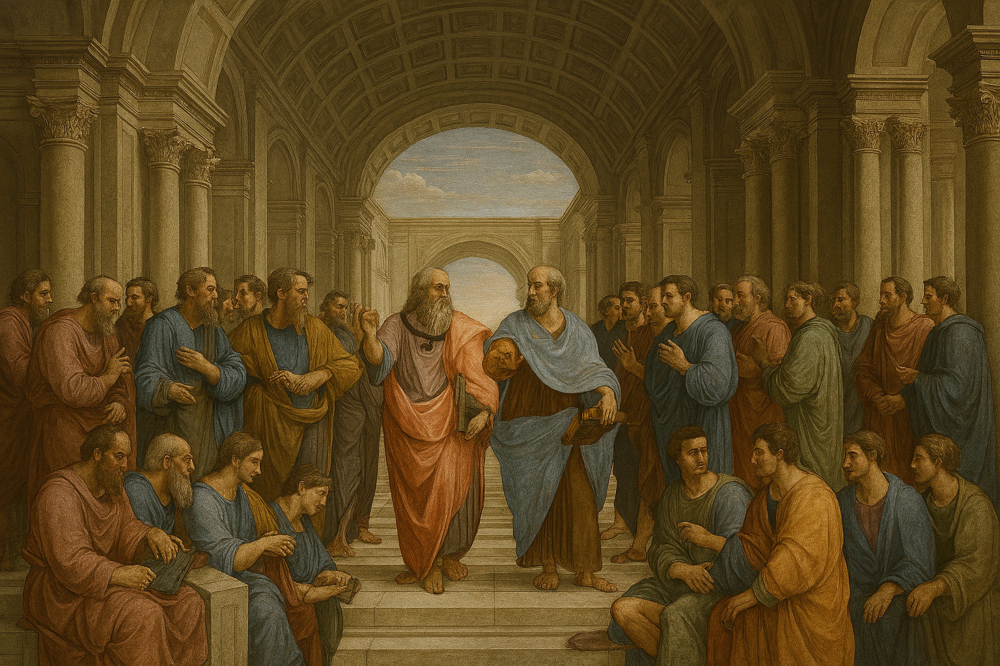

**Prompt 1**
Theme: Art as religious instruction

Period: Middle Ages (Romanesque)

Inspired by: Church of Sainte-Foy

Prompt:
This is a medieval stone church with thick walls, small windows, and round arches. At the entrance, there are carved figures showing heaven and hell. The figures are simple and some are bigger to show importance. The design looks heavy and strong.
This was made to teach religion to people who cannot read. People can understand religious stories by seeing the carvings. It shows how important religion was in the Middle Ages.

**Prompt 2**
Theme: Humanism

Period: Renaissance

Inspired by: School of Athens

Prompt:
This is a Renaissance painting showing many people inside a large building with arches and columns. The space looks deep using perspective. The people look realistic with natural body shapes and expressions. The design is balanced and organized.
This was made to show the importance of human thinking and knowledge. It reflects humanism, where people focus on education, philosophy, and science. It shows how people started valuing human ideas during the Renaissance.

